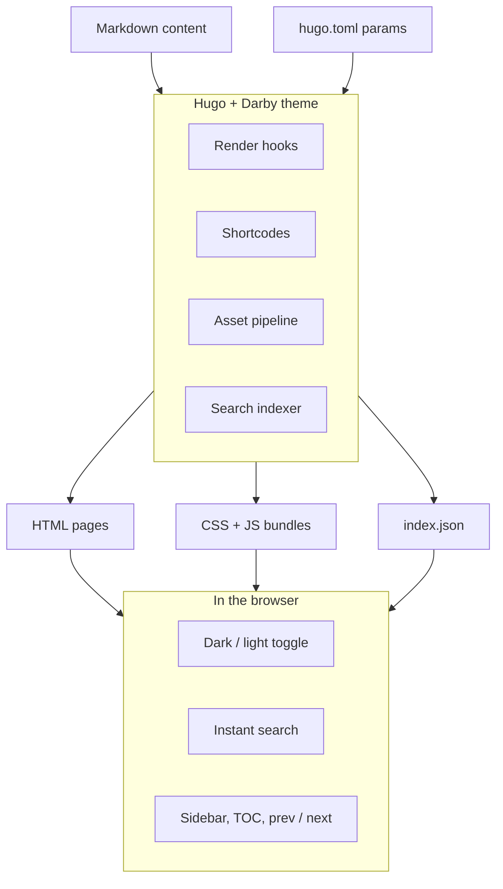
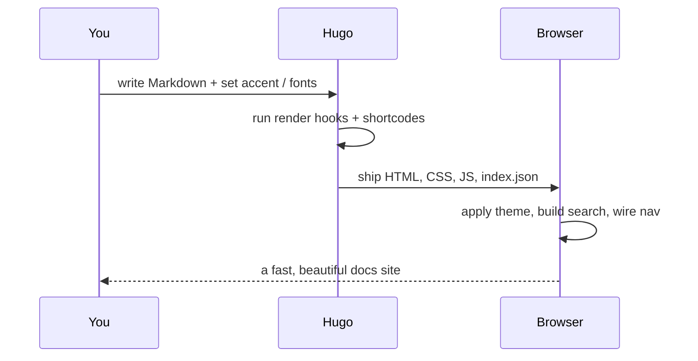
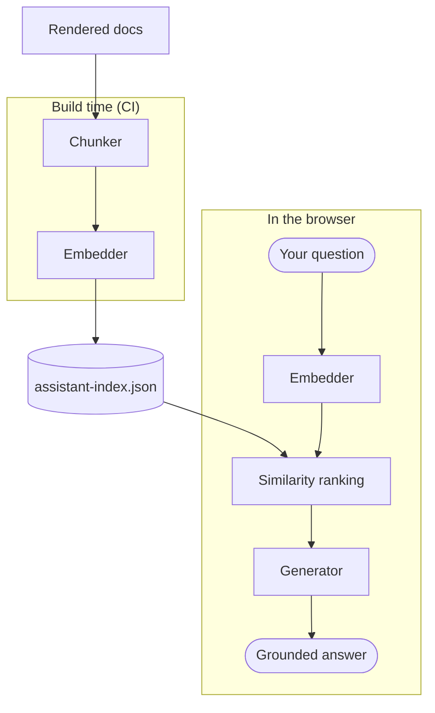

+++
title = "Architecture"
weight = 4
description = "How Darby turns your Markdown and config into a finished documentation site."
+++

Darby is a Hugo theme, so there is no separate build tool or server. Your Markdown
and a small `[params]` block flow through Hugo, and Darby's render hooks, shortcodes,
and asset pipeline turn them into a static site that runs entirely in the browser.

## How it fits together

The diagram below renders from a plain ` ```mermaid ` code fence: you write the
fence, the theme draws it (hand-drawn style, themed to your accent color, and it
re-draws when you toggle dark and light).



## The pieces

- **Render hooks** turn fenced code into highlighted blocks (with copy buttons and
  filenames), headings into anchored links, and GitHub-style alerts into callouts.
- **Shortcodes** give you callouts, tabs, cards, steps, and accordions.
- **Asset pipeline** compiles the design tokens and your configured accent and fonts
  into one CSS bundle, and concatenates the small scripts into one JS bundle.
- **Search indexer** emits `index.json` so client-side search works with no server.

## A sequence, end to end



## Ask Assistant

The optional Ask Assistant answers questions about your docs with no backend. The
heavy thinking is split in two: the docs are turned into a searchable index once
at build time, and the browser only has to reason about a single question.



- **Chunker** splits each rendered page into self-contained sections.
- **Embedder** (`bge-small-en-v1.5`) turns text into vectors. The same model runs
  at build time on the chunks and in the browser on your question, so they share
  one meaning space.
- **assistant-index.json** ships with the site: every chunk's text, URL, and vector.
- **Similarity ranking** keeps the few chunks closest to the question vector.
- **Generator** (`Llama-3.2-1B`, in the browser) writes an answer grounded only in
  those chunks, with citations. A hosted OpenAI-compatible model can replace it.
